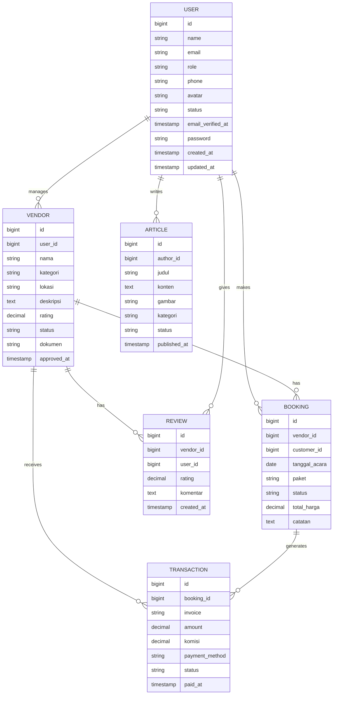

<p align="center">

<h1 align="center">Credsh</h1>
</p>

## Tentang Proyek

Platform manajemen vendor pernikahan terintegrasi yang menyediakan:

- 🎯 Pencarian vendor pernikahan (fotografi, katering, dekorasi) dengan sistem rekomendasi
- 💳 Sistem booking dan pembayaran online terintegrasi midtrans
- ✍️ Manajemen artikel dan konten pernikahan dengan editor WYSIWYG
- 👨💻 Sistem role management tiga level (Admin, Vendor, Customer)
- 📊 Laporan dan analisis transaksi real-time
- 📱 Responsive design untuk semua perangkat
- 🌐 Multi-language support (Indonesia & English)

## Fitur Utama

### Untuk Pelanggan
- 🛍️ Pencarian vendor dengan filter kategori, harga, rating, dan lokasi
- ⭐ Sistem rating dan ulasan vendor
- 📅 Kalender ketersediaan vendor real-time
- 💌 Notifikasi email & SMS untuk transaksi
- 📑 Riwayat transaksi dan invoice

### Untuk Vendor
- 📈 Dashboard manajemen pesanan
- 🖼️ Galeri portfolio dan upload dokumen
- 💰 Manajemen komisi dan penarikan dana
- 📦 Manajemen paket layanan
- 📆 Kalender manajemen jadwal

### Untuk Admin
- 🔐 Manajemen user dan approval vendor
- 📝 Modul CMS untuk konten artikel
- 🚨 Sistem monitoring transaksi mencurigakan
- 📉 Analitik pertumbuhan bisnis
- ⚙️ Konfigurasi sistem dan komisi

## Diagram Database


## Instalasi

1. Clone repositori
```bash
git clone https://github.com/maousamanatz/weddingapps.git
cd weddingapps
```

2. Salin file env dan konfigurasi:
```bash
cp .env.example .env
nano .env # Sesuaikan dengan setting database dan API keys
```

3. Install dependencies:
```bash
composer install
npm install
npm run build
```

4. Generate key dan optimasi:
```bash
php artisan key:generate
php artisan optimize:clear
php artisan storage:link
```

5. Migrasi database dengan data dummy:
```bash
php artisan migrate --seed
```

6. Jalankan server development:
```bash
composer run dev
```

## Environment Variables Penting
```env
APP_NAME=WeddingApps
APP_ENV=local
APP_DEBUG=true
DB_CONNECTION=mysql
DB_HOST=127.0.0.1
DB_PORT=3306
DB_DATABASE=weddingapps
DB_USERNAME=root
DB_PASSWORD=

MIDTRANS_SERVER_KEY=
MIDTRANS_CLIENT_KEY=
MIDTRANS_MERCHANT_ID=

MAIL_MAILER=smtp
MAIL_HOST=mailhog
MAIL_PORT=1025
MAIL_USERNAME=null
MAIL_PASSWORD=null
MAIL_ENCRYPTION=null

GOOGLE_MAPS_API_KEY=
```

## Teknologi Utama
- **Backend**: Laravel Framework 11.41.3
- **Frontend**: React + Inertia.js
- **Database**: MySQL 8 (Relational Database)
- **Payment Gateway**: -
- **Search Engine**: -
- **Session & Cache**: -
- **Real-time Communication**: Laravel Echo + WebSockets

## Kontribusi
1. Fork repository
2. Buat branch fitur (`git checkout -b fitur-baru`)
3. Commit perubahan (`git commit -am 'Tambahkan fitur baru'`)
4. Push ke branch (`git push origin fitur-baru`)
5. Buat Pull Request

## Dokumentasi API
Lihat dokumentasi API lengkap di [API Documentation](https://documenter.getpostman.com/view/12345678/2sA3BXYZXY)

## Lisensi
MIT License © 2024 Maousamanatz
